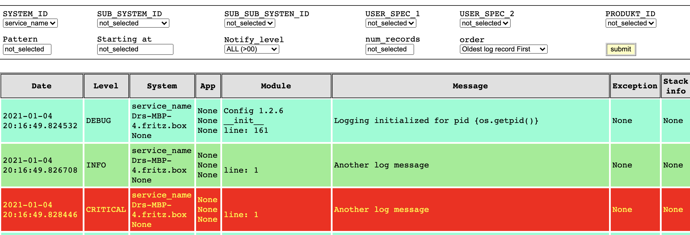

=====
Usage
=====

.. Setup ( Not Visible)
    >>> import os
   
   
The ``ps.basic`` package implements utilities helping in the development of distributed 
services within the ps environment.

    - easing setup for staging environments
    - easing setup for logging
    - easing setup for configuration files
    - locking mechanisms to guard against execution of multiple service instances
    - basics to implement and document services based on finite state machines 
 

Core Mechanism Easing setup for staging environments
====================================================

At the core of the ps.basic package is the ``ps.basic.DEV_STAGES`` dictionary holding default
values for the staging environments.

    >>> import pprint,os
    >>> import ps.basic
    >>> print(pprint.pformat(ps.basic.DEV_STAGES)) # doctest: +NORMALIZE_WHITESPACE
    {'DEVELOPMENT': {'l_admin_mail': ['d_test@somewhere.com'],
                     'logging_bridge_port': 9019,
                     'logging_level': 10,
                     'logging_port': 9020,
                     'suffix': '_d'},
     'INTEGRATION': {'l_admin_mail': ['itest@somewhere.com'],
                     'logging_bridge_port': 9018,
                     'logging_level': 10,
                     'logging_port': 9022,
                     'suffix': '_i'},
     'PRODUCTION': {'l_admin_mail': ['production@somewhere.com'],
                    'logging_bridge_port': 9017,
                    'logging_level': 10,
                    'logging_port': 9024,
                    'suffix': ''},
     'TESTING': {'l_admin_mail': ['test@somewhere.com'],
                 'logging_bridge_port': 9011,
                 'logging_level': 10,
                 'logging_port': 9010,
                 'suffix': '_t'}}
 
``logging_level`` defines the logging level to be used, ``logging_port`` and ``logging_bridge_port``
are used with the help of `ps.herald and ps_bridge <https://psherald.readthedocs.io/en/latest/>`_: to
handle the streams of logging messages.
``suffix`` is  used to define a DEV_STAGE specific suffix for configuration and logging files.
``l_admin_mail`` provides a list of email addresses to be used to send emails to service specific admins.

Initially the attributes in ``ps.basic.Config`` are undefined.

    >>> import ps.basic.Config
    >>> assert (ps.basic.Config.suffix == "not_yet_defined")
    >>> assert (ps.basic.Config.logger == "not_yet_defined")
  
    >>> assert (ps.basic.Config.log_file_name == "not_yet_defined")
    >>> assert (ps.basic.Config.config_file_name == "not_yet_defined")

On instantiation of the ps.basic.Config.Basic class the DEV_STAGE os.environ["DEV_STAGE"] is consulted
to initialize values to be used. If the given value of ``os.environ["DEV_STAGE"]`` is not 
in [\'DEVELOPMENT\', \'INTEGRATION\', ...] instantiation will raise an error.
 
    >>> from ps.basic.Config import Basic 
    >>> os.environ["DEV_STAGE"] = "IMPOSSIBLE_STAGE" # documented below
    >>> service_name = "service_name"
    >>> do_not_care = Basic(service_name) # doctest: +IGNORE_EXCEPTION_DETAIL
    Traceback (most recent call last):
    ...
    ps.basic.Config.ForbiddenInitialisationOfSingleton: DEV_STAGE IMPOSSIBLE_STAGE not an Allowed DEVELOPMENT STAGE

Provided an allowed value for DEV_STAGE a singleton instance will be created.

    >>> os.environ["DEV_STAGE"] = "DEVELOPMENT" # documented below
    >>> from ps.basic.Config import Basic 
    >>> Basic(service_name) # doctest:+ELLIPSIS
    <ps.basic.Config.Basic object at ...>

It will have set values at least for logging files
 
    >>> assert (ps.basic.Config.suffix == "_d")
    >>> assert (ps.basic.Config.log_file_name.endswith("LOG/service_name_d.log"))

 
.. The following lines are here to reset the doctest environment - they are NOT needed in the application.
    >>> def reset_singleton():
    ...     from importlib import reload  
    ...     ps.basic.Config = reload(ps.basic.Config)
    ...     assert (ps.basic.Config.suffix == "not_yet_defined")
    ...     assert (ps.basic.Config.logger == "not_yet_defined")
 
Easing setup for logging
========================

Given the above initialisation: 

    - a directory named ``LOG`` inside the working directory is created
    - a file named ``LOG/service_name_d.log`` holding log entries is created

    >>> assert os.path.isdir("LOG")
    >>> assert os.path.isfile("LOG/service_name_d.log")

The content of the log-file LOG/service_name_d.log looks like:

=================== === ===== === ==================================================================
TIME                ... LEVEL ... MESSAGE
=================== === ===== === ==================================================================
2020-12-11 09:53:12 ... DEBUG ... Logging initialized for pid 18011
2020-12-11 09:53:12 ... DEBUG ... No config file /Users/setzt/ps.basic/docs/service_name_d.cfg given
2020-12-11 09:53:12 ... DEBUG ... Error setting PATTERN_LANGUAGE. Use default EN.
=================== === ===== === ==================================================================

A Module being used in the application could simply add additional log messages to the logging ...

    >>> from ps.basic.Config import logger
    >>> logger.info("Another log message") 
    >>> logger.fatal("Another log message") 

.. Reset the environment ...
    >>> reset_singleton()

This would end up in additional entries in the log file ...

=================== === ===== === ==================================================================
TIME                ... LEVEL ... MESSAGE
=================== === ===== === ==================================================================
2020-12-11 09:53:12 ... DEBUG ... Logging initialized for pid 18011
2020-12-11 09:53:12 ... DEBUG ... No config file /Users/setzt/ps.basic/docs/service_name_d.cfg given
2020-12-11 09:53:12 ... DEBUG ... Error setting PATTERN_LANGUAGE. Use default EN.
2020-12-11 09:53:15 ... INFO  ... Another log message
2020-12-11 09:53:15 ... FATAL ... Another log message
=================== === ===== === ==================================================================

The used ``logger`` is based on the standard python logging module enhanced by file_name, line_number 
and some more easers. 
Furthermore with the help of `ps.herald and ps_bridge <https://psherald.readthedocs.io/en/latest/>`_:

    - an easy to use GUI to analyze the logging messages is available
    - tools to establish a distributed logging environment are available. 

Using ps_herald those log messages would be displayed as given in the following picture: 

.. note::
   To get access to the ps logging environment, a module only needs to:
 
      - instantiate  the ps.basic.Config.Basic class, if not already done at  startup of the 
        application. Instantiation has only one required parameter - the service name.
      - import the logger from ps.basic.Config

    Additionaly, that logger e.g **logger.info("The logging message")** may be extended 
    with an extra dict() e.g.

      - logger,info("The logging message"**, extra={"package_version":TheOthersModules_versionNumber"}**) 

    enabling the module to participate in the ps-monitoring environment *with it's verson number*.
    This is a major requirement for ITIL. 

    The design decisions take this into account. Python2 versions of services should integrate 
    smoothly - as they use the same messages (techically pickled over network streams). 

     
    
Easing setup for configuration files 
====================================

The ``ps.basic.config`` module  additionally defines a config_parser (Standard python ConfigParser 
instance) through which access to  the service specific configuration is possible/enforced from 
every module of the application.

First we reset the singleton within this test/documentation document.

    
Given a config_file which has to follow the naming convention, the content could be read from 
anywhere within the application. In the example we first write a config file.
    
    >>> config_filename = os.path.join("/tmp", service_name + "_d.cfg") 
    >>> fp=open(config_filename,"w")  # and the suffix for the development stage.
    >>> written = fp.write("[GLOBAL]" + os.linesep)   
    >>> written = fp.write("pattern_language = DE" + os.linesep)   # They follow the ini syle (ms-world) for
    >>> written = fp.write("LOGGING = DEBUG" + os.linesep)            # The logging level may be set
    >>> fp.close()                                    # configuration files.
    >>> os.environ["BASIC_CONFIGFILE_DIR"] = "/tmp"   # you can overwrite the path to the config file

Next we instantiate the ``ps.basic.Config.Basic`` singleton.

    >>> os.environ["DEV_STAGE"] = "DEVELOPMENT" # documented below
    >>> Basic(service_name,have_config_file=True) # doctest:+ELLIPSIS
    <ps.basic.Config.Basic object at ...>

The configuration Data is available - and could be read from the application. 

    >>> assert('GLOBAL' in ps.basic.Config.config_parser.sections())
    >>> assert(ps.basic.Config.config_parser['GLOBAL']['pattern_language'] == 'DE')

Using ps_herald those log messages would be displayed as given in the following picture: 

.. Cleanup the test environment. ....

    >>> if os.path.isfile(ps.basic.Config.lock_file_name):
    ...     os.remove(ps.basic.Config.lock_file_name) # just cleanup the test environment
    >>> reset_singleton()
    >>> if os.path.isfile(ps.basic.Config.config_file_name):
    ...    os.remove(ps.basic.Config.config_file_name)  # just cleanup the test environment

Easing setup for service locking 
================================

To guard against multiple service instances running in parallel, the ``guarded_by_lockfile``
 Flag is used.

If the Basic singleton is instantiated with this flag, 

    >>> Basic(service_name, guarded_by_lockfile = True) # doctest:+ELLIPSIS
    <ps.basic.Config.Basic object at ...>

it stores it's PID in ``ps.basic.Config.lock_file_name``

    >>> pid = open(ps.basic.Config.lock_file_name,"r").read()
    >>> assert(int(pid) == os.getpid()) 

.. Reset the environment ...
    >>> reset_singleton()

If the start of the service finds a running instance, the instantiation will raise an error.

    >>> do_not_care = Basic(service_name, guarded_by_lockfile = True) # doctest: +IGNORE_EXCEPTION_DETAIL
    Traceback (most recent call last):
    ...
    ps.basic.Config.LockedInitialisationOfSingleton: locked by still alive process with pid 567567 for 00:00:00 dsadsad

If there is no running instance, the lock file will be deleted. 

This makes sure, that always only one instance of the service is running on the local machine.
 
Using ps_herald those log messages would be displayed as given in the following picture: 

Finite State Machine
====================

Designing/Testing/integrating and Implementing a service is a complex business.
Version Numbers of the service implementation itself - or used libraries/methods are crucial.

Using Finite State Machines as Model is a good "ComputerScience" Modelling Environment.

A visual representaion of the beyond implemented FinitStateMachine is giving below.
 
.. image:: TheMachine.svg

The picture is generated in section :ref:`Documenting the Finite State Machine <Documenting the Finite State Machine>`

In the following sections:
      - We show how to import the needed modules/methods
      - define handler_functions for the states 
      - define states  using those handler_functions for the states
      - **generate that picture from the implementations source code** -
        as opposed to implement the behaviour as assumed by a third party 
        picture. The here shown picture is **much closer** to what the service 
        does. It can be checked within the dev_stage based monitoring environments.

---------------------------------------------------
Importing the Finite State Machines Modules/methods
---------------------------------------------------
To import  the fsm functionality we do:

   >>> from ps.basic.State import State, StateError
   >>> from ps.basic.fsm import FiniteStateMachine, TransitionError
   >>> from ps.basic.get_graph import get_graph

---------------------------------
Defining state visiting functions
---------------------------------
Now we define handler_functions, wich will be called on entering a state.

A handler function  has two parameters :

      - state : State #giving information on the entered state 
      - context : dict #giving information on the dict beeing provided (initially empty in fsm.run() 

   >>> def init_state_handler(state: State, context_p: dict) -> str:
   ...   __doc__="""This is the documentation of init_state_handler"""
   ...   context_p[state.name] = "visited"
   ...   return "INIT_OK" 
   >>> def state1_handler(state: State, context_p: dict) -> str:
   ...   __doc__="""This is the documentation of state1_state_handler"""
   ...   context_p[state.name] = "visited"
   ...   return "STATE1_OK" 
   >>> def error_state_handler(state: State, context_p: dict) -> str:
   ...   __doc__="""This is the documentation of error_state_handler"""
   ...   context_p[state.name] = "visited"
   ...   return "ERROR_STATE_OK" 
   >>> def fin_state_handler(state: State, context_p: dict) -> str:
   ...   context_p[state.name] = "visited"
   ...   return "FIN_STATE_OK" 

---------------
Defining states 
---------------

Given the now defined handler_functions, we are now able to define State variables using
those handler functions.

   >>> final = State("FINAL", fin_state_handler, final=True)
   >>> error = State( "ERROR",error_state_handler, error=True,
   ...     mail_addr='[{"A":"ror_handler@mail.company"}]',
   ...     default=final,)   
   >>> start = State("START", init_state_handler, initial=True, default=error)
   >>> state1 = State("STATE1", state1_handler, default=error)

The error state has an mail_addr attached. Entering that state will result in sending an email to that address.

---------------------------------------------------
Defining state changes as result of a state handler 
---------------------------------------------------

Now we have 4 State Instances named final, error, start and state1.
Now we add transitions :

   - if in state start  and init_state_handler() returns "INIT_OK" we switch to state state1 
   - if in state state1 and state1_state_handler() returns "STATE1_OK" we switch to state final 
   - if in state error  and error_state_handler() returns "ERROR_STATE_OK" we switch to state final 
 

   >>> start["INIT_OK"] = state1
   >>> state1["STATE1_OK"] = final
   >>> error["ERROR_STATE_OK"] = final 

--------------------------------
Running the Finite State Machine
--------------------------------
   >>> fsm = FiniteStateMachine("TheMachine")
   >>> fsm.add_state([start, state1, error, final])
   >>> fsm.run({})

The logging messages in herald are shown in the following picture.

------------------------------------
Documenting the Finite State Machine
------------------------------------
A picture of the State machine could be generated and helps in communicating service behaviour.

   >>> graph = get_graph(fsm)
   >>> graph.draw(f"{fsm.name}.svg", prog="dot")

.. Comment  Copy the file to the documentation environment
   >>> assert os.path.isfile(f"{fsm.name}.svg") 
   >>> from shutil import copyfile
   >>> copyfile(f"{fsm.name}.svg", f"../docs/source/{fsm.name}.svg") 
   '../docs/source/TheMachine.svg'

.. image:: TheMachine.svg

